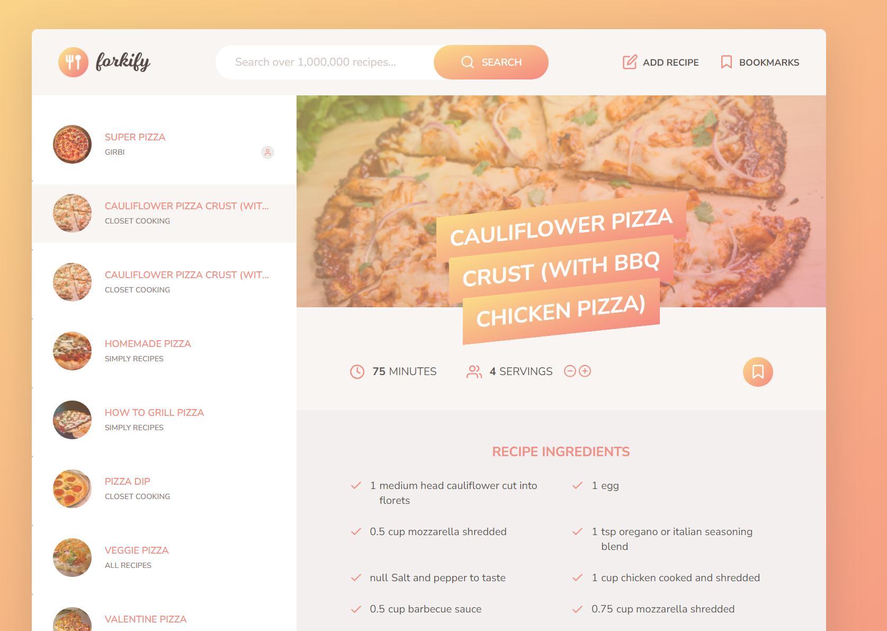

# Forkify

Recipe application with custom recipe uploads. Inspired from Jonas Schmedtmann

[Forkify Demo](https://forkify-girbi.netlify.app)

## Description

- Recipe Search: Users can search for recipes using keywords, such as dish name or ingredient.
- Recipe Details: Detailed information about each recipe, including ingredients, cooking instructions, and nutritional information.
- Save Recipes: Users can save their favorite recipes for quick access later.
  Shopping List: Automatically generate a shopping list based on the ingredients of selected recipes.
- Responsive Design: The application is designed to work seamlessly on various devices, including desktops, tablets, and smartphones.

## Technologies

- HTML5
- SASS
- Javascript (API, OOP, AJAX)
- Parcel
